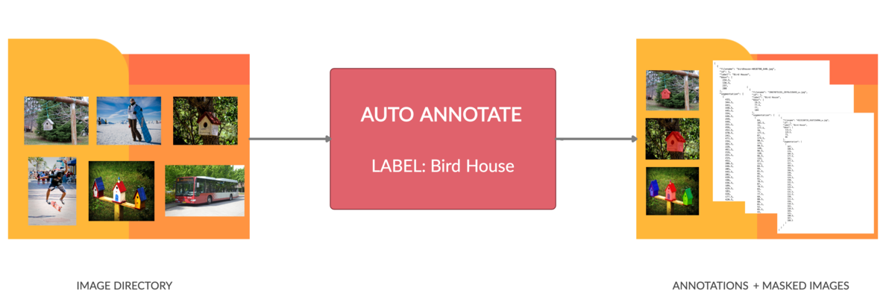
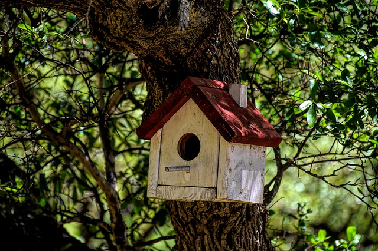
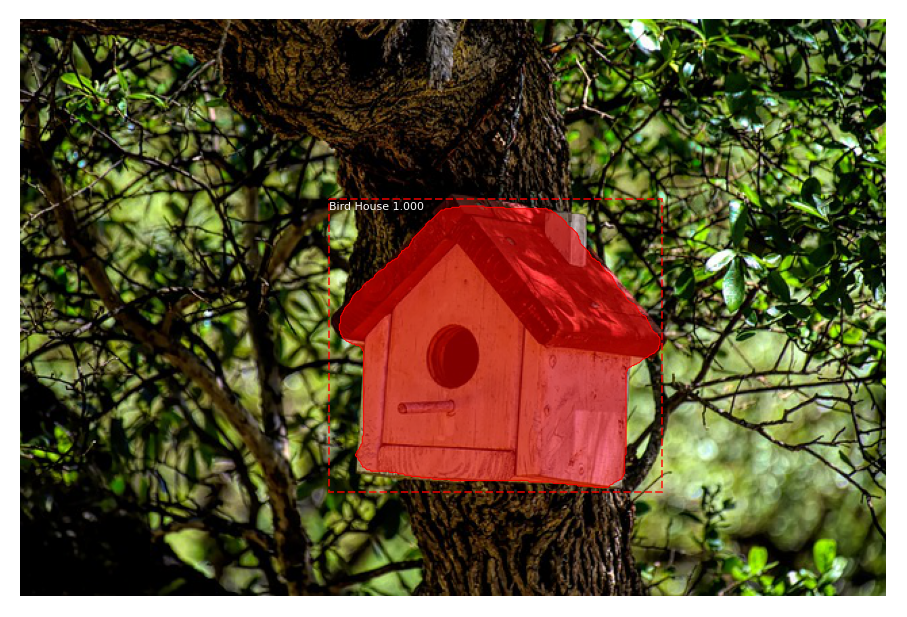

<p align="center"><a href="https://github.com/mdhmz1/Auto-Annotate#mdhmz1"></a></p>
<h1 align="center">Auto-Annotate</h1>
<p align="center">Automatically annotate your entire image directory by a single command. </p>

<p align="center">  </p>


For a more detailed explaination and code usage, please refer to this [medium article](https://medium.com/analytics-vidhya/automated-image-annotation-using-auto-annotate-tool-f8fff8ea4900).

<a href="https://medium.com/analytics-vidhya/automated-image-annotation-using-auto-annotate-tool-f8fff8ea4900"> </a>


**As simple as saying - "Annotate all the street sign (label) in the autonomous car dataset (directory)" and BAM! DONE.**
Each and every image with a street sign in the diverse dataset directory containing images of all sorts which have a street sign are filtered and the segmentation annotation is performed in a single command.

The Auto-Annotate tool provides auto annotation of segmentation masks for the objects in the images inside some directory based on the labels. Auto-Annotate is able to provide automated annotations for the labels defined in the COCO Dataset and also supports Custom Labels. This tool is built on top of [Mask R-CNN](https://github.com/matterport/Mask_RCNN) to support auto annotation for each instance of an object segment in the image. 



The Auto-Annotate tool works on two modes
* **COCO Label Annotation** - NO TRAINING REQUIRED. Just use the weights of the the Coco dataset. Point to the directory and the annotations are ready.
* **Custom Label Annotation** - Train the model for the custom label. Use the weights and annotate.

NOTE: Please refer to [knownIssues.md](knownIssues.md) file in the repo for known issues and their resolution. Please feel free to contribute in case of any errors/issues arising during the installation and usage of the tool.

## JSON Annotation Format

### SAMPLE JSON: 

```json
[
  {
    "filename": "bird_house_in_lawn.jpg",
    "id": 1,
    "label": "Bird House",
    "bbox": [ 111.5, 122.5, 73, 66 ],
    "segmentation": [
      [ 167, 188.5, 174, 185.5, 177.5, 181, 177.5, 157, 183.5, 154, 184.5, 149, 159, 124.5, 150, 122.5, 
        142, 124.5, 131, 131.5, 111.5, 150, 111.5, 156, 116.5, 162, 116.5, 184, 121, 188.5, 167, 188.5
      ]
    ]
  }
]
```

### JSON FORMAT:
```
[
  {
    "filename": image_file_name,
    "id": id_of_the_image,
    "label": label_to_search_and_annotate,
    "bbox": [ x, y, w, h ], -- x,y coordinate of top left point of bounding box
                            -- w,h width and height of the bounding box
                            Format correspond to coco json response format for bounding box
    "segmentation": [
      [ x1, y1, x2, y2,...] -- For X,Y belonging to the pixel location of the mask segment
                            -- Format correspond to coco json response format for segmentation
    ]
  }
]
```

###
ORIGINAL IMAGE             |  MASKED IMAGE
:-------------------------:|:-------------------------:
  |  


## Installation
1. Clone this repository

2. Install dependencies
   ```bash
   pip3 install -r requirements.txt
   ```

3. **If annotating objects supported by COCO Dataset** 
  Download pre-trained COCO weights (mask_rcnn_coco.h5) from the [releases page](https://github.com/matterport/Mask_RCNN/releases) and store it in the root directory.
  **If annotating objects Custom Objects** 
  Train Mask RCNN and use those weights.

4. Run Commands as below based on the mode.
  ```bash
  python3 annotate.py annotateCoco --image_directory=/path/to/the/image/directory/ --label=object_label_to_annotate --weights=/path/to/weights.h5 --displayMaskedImages=False
  ```
  ```bash
  python3 annotate.py annotateCustom --image_directory=/path/to/the/image/directory/ --label=object_label_to_annotate --weights=/path/to/weights.h5 --displayMaskedImages=False
  ```

5. Find the annotations in the directory - /path/to/the/image/directory/ specified above


## Annotating on MS COCO
Use pre-trained weights for MS COCO. After finishing with the installation, we
can run it directly from the command line as such:

```
# Annotate label defined by COCO
python3 annotate.py annotateCoco --image_directory=/path/to/the/image/directory/ --label=object_label_to_annotate --weights=/path/to/weights.h5 --displayMaskedImages=False
```
Note: --label=object_label_to_annotate should be in accordance to the COCO dataset labels.
Refer [COCO Dataset](https://cocodataset.org/) for more details.

## Annotating on Custom Images
Use pre-trained weights for the custom label. After finishing with the installation, we
can run it directly from the command line as such:

```
# Annotate Custom
python3 annotate.py annotateCustom --image_directory=/path/to/the/image/directory/ --label=object_label_to_annotate --weights=/path/to/weights.h5 --displayMaskedImages=False
```
Note: --label=object_label_to_annotate should be a label for which the weights are provided.


## Training on Your Own Dataset

Read the original post by Waleed Abdulla [blog post about the balloon color splash sample](https://engineering.matterport.com/splash-of-color-instance-segmentation-with-mask-r-cnn-and-tensorflow-7c761e238b46) where he explained the process starting from annotating images to training to using the results in a sample application.

The use train.py which is a modified version of balloon.py written by Waleed to support only the training part.
```
    # Train a new model starting from pre-trained COCO weights
    python3 customTrain.py train --dataset=/path/to/custom/dataset --weights=coco

    # Resume training a model that you had trained earlier
    python3 customTrain.py train --dataset=/path/to/custom/dataset --weights=last
```

## :clap: Supporters

### :star: Stargazers
[](https://github.com/mdhmz1/Auto-Annotate/stargazers)
### :twisted_rightwards_arrows: Forkers 
[](https://github.com/mdhmz1/Auto-Annotate/network/members)

##

[🤝 CONNECT WITH ME ON LINKEDIN](https://www.linkedin.com/in/mdhmz1/)


<a href="https://www.linkedin.com/in/mdhmz1/"> </a>

##